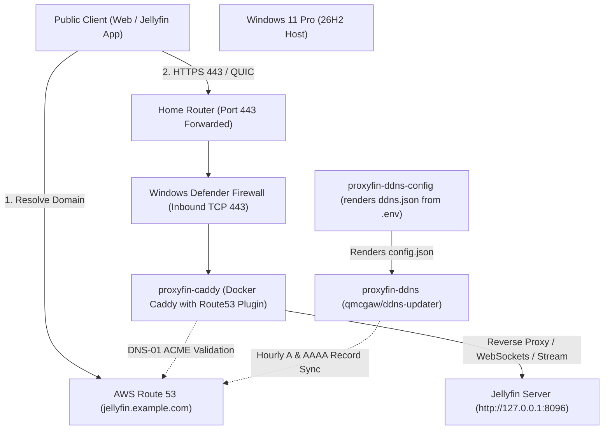

# proxyfin

A lean, fire-and-forget reverse proxy solution designed to safely expose a Jellyfin media server running on Windows 11 Pro to the public internet.

Built with **Caddy**, **Route53 DNS-01 Let's Encrypt validation**, and **automated dual-stack dynamic DNS (DDNS)**.

---

## Architecture



### Key Highlights

- **Zero-touch TLS**: Uses Caddy with the `caddy-dns/route53` plugin to complete ACME DNS-01 challenges directly through the AWS Route53 API.
- **Port 80 Stays Closed**: Unlike standard HTTP-01 challenges, DNS-01 does **not** require port 80 to be open on your router or ISP connection.
- **Single Source of Credentials**: `.env` is the only file you edit. A one-shot `proxyfin-ddns-config` container renders `config/ddns.json.template` into `data/ddns/config.json` on every `docker compose up`, so AWS credentials and the domain/subdomain never need to be duplicated by hand.
- **Dual-Stack DDNS**: `qmcgaw/ddns-updater` continuously tracks both public IPv4 (`A`) and IPv6 (`AAAA`) addresses and syncs them with Route53 with a 3600-second (1 hour) TTL.
- **Least-Privilege Security**: An IAM policy (`iam-policy.json`) scoped strictly to your Route53 hosted zone.
- **Non-Mutating Host Diagnostics**: `Verify-Setup.ps1` audits firewall rules, DNS synchronization, Docker daemon, container health, and TLS certificates without modifying system state.

---

## Directory Layout

```text
proxyfin/
├── .dockerignore              # Keeps secrets/runtime data out of the Docker build context
├── .env.example               # Environment variables template
├── .gitignore                 # Protects credentials and local state
├── Caddyfile                  # Caddy reverse proxy and security header definitions
├── Dockerfile                 # Custom Caddy build (pinned version) including caddy-dns/route53 plugin
├── Dockerfile.ddns-init       # Renders config/ddns.json.template from .env at container start
├── compose.yaml               # Docker Compose service definition
├── iam-policy.json            # Minimal AWS IAM policy for Route53 record management
├── Verify-Setup.ps1           # Non-mutating diagnostic script
├── docker/
│   └── render-ddns-config.sh # Entrypoint script for the ddns-config renderer container
├── config/
│   └── ddns.json.template    # envsubst template for dual-stack ddns-updater config
└── data/                     # Mounted runtime data (Caddy cert storage, rendered ddns.json, DDNS cache)
```

---

## Quick Start Guide

### 1. Create AWS IAM Policy & Credentials

1. In the AWS Console, navigate to **IAM > Policies > Create Policy**.
2. Switch to the **JSON** editor and paste the contents of [`iam-policy.json`](./iam-policy.json). Name the policy `proxyfin-route53-policy`.
3. Create an IAM user named `proxyfin` with **Programmatic Access / Access Key**.
4. Attach `proxyfin-route53-policy` directly to the `proxyfin` user.
5. Save the generated `AWS_ACCESS_KEY_ID` and `AWS_SECRET_ACCESS_KEY`.

### 2. Configure Environment

1. Copy [`.env.example`](./.env.example) to `.env`:

   ```powershell
   Copy-Item .env.example .env
   ```

2. Edit `.env` and fill in your domain and AWS credentials:

   ```env
   DOMAIN=example.com
   SUBDOMAIN=jellyfin
   HOSTED_ZONE_ID=YOUR_HOSTED_ZONE_ID
   AWS_REGION=us-east-1
   AWS_ACCESS_KEY_ID=AKIA...
   AWS_SECRET_ACCESS_KEY=...
   ```

   `DOMAIN` is your Route53 hosted zone's apex (e.g. `example.com`) and `SUBDOMAIN` is the host label the proxy is served from (e.g. `jellyfin`); Caddy composes the full `jellyfin.example.com` from both.

   `.env` is the **only** file you need to edit. On every `docker compose up`, the one-shot `proxyfin-ddns-config` container renders `config/ddns.json.template` into `data/ddns/config.json` for `ddns-updater` — there's no separate `ddns.json` to maintain by hand.

   *Note*: `HOSTED_ZONE_ID` is also passed through to the `proxyfin-caddy` container and used directly (as `hosted_zone_id` in the `Caddyfile`'s `dns route53` block) by the `caddy-dns/route53` plugin to scope ACME DNS-01 requests to that zone (matching the zone-scoped statement in `iam-policy.json`), rather than relying on `route53:ListHostedZonesByName` to discover it.

### 3. Open Windows Defender Firewall (TCP 443)

If not already open, create an inbound firewall rule allowing HTTPS traffic to the proxy. Run PowerShell as Administrator:

```powershell
New-NetFirewallRule -DisplayName "Proxyfin Reverse Proxy (HTTPS)" -Direction Inbound -LocalPort 443 -Protocol TCP -Action Allow
```

### 4. Router Port Forwarding

In your home router management interface:

- Forward external port **443 (TCP and UDP)** to the local IP address of this Windows machine.
- *Note*: Port 80 does not need to be forwarded.

### 5. Build and Launch Containers

Ensure Docker Desktop is running on Windows, then run:

```powershell
docker compose up -d --build
```

---

## Verification & Health Check

Run the included non-mutating PowerShell diagnostic script from this directory:

```powershell
.\Verify-Setup.ps1
```

The script verifies:

1. **Configuration**: Verifies `.env` exists, contains no default placeholders, and that `data/ddns/config.json` has been rendered.
2. **Local Jellyfin Backend**: Confirms local port 8096 is listening and the Jellyfin server API responds.
3. **Docker Containers**: Confirms `proxyfin-caddy` and `proxyfin-ddns` containers are running.
4. **Firewall**: Checks that Windows Defender Firewall allows inbound TCP 443.
5. **DNS Synchronization**: Compares your actual public IPv4 and IPv6 against Route53 A and AAAA records.
6. **TLS Certificate & Reachability**: Performs remote TLS handshake, checks Let's Encrypt certificate validity and expiration date, and validates HSTS headers.

---

## Maintenance & Operations

- **Viewing Caddy logs**:

  ```powershell
  docker logs -f proxyfin-caddy
  ```

- **Viewing DDNS updater logs**:

  ```powershell
  docker logs -f proxyfin-ddns
  ```

- **HSTS Policy**: Initial HSTS header is configured to `max-age=3600` (1 hour) for safe testing. Once connectivity is confirmed stable, you can adjust `Strict-Transport-Security` in [`Caddyfile`](./Caddyfile) to `max-age=31536000; includeSubDomains`.
- **Cloudflare WARP compatibility**: If the host runs Cloudflare WARP (or another full-tunnel VPN), `ddns-updater`'s public IP detection will report the VPN's egress IP instead of your real WAN IP unless excluded. `compose.yaml` pins `ddns-updater` to a single HTTP provider (`PUBLICIP_FETCHERS=http`, `PUBLICIP_HTTP_PROVIDERS=ipify`) and disables DNS-based detection, so only one domain — `api64.ipify.org` — needs to be added to WARP's Split Tunnel exclusions (Settings > Advanced > Split Tunnels) for accurate detection.
