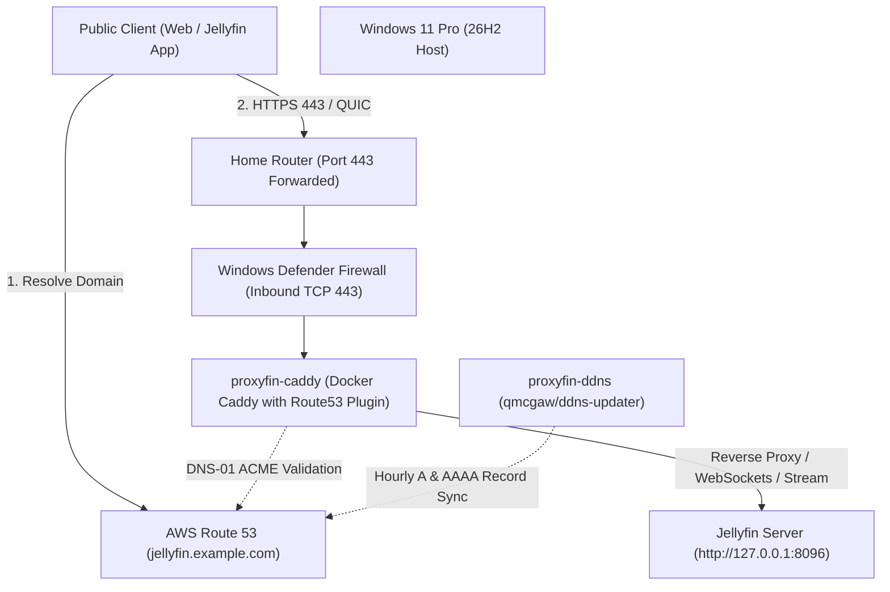

# proxyfin

A lean, fire-and-forget reverse proxy solution designed to safely expose a Jellyfin media server running on Windows 11 Pro to the public internet.

Built with **Caddy**, **Route53 DNS-01 Let's Encrypt validation**, and **automated dual-stack dynamic DNS (DDNS)**.

---

## Architecture



### Key Highlights
- **Zero-touch TLS**: Uses Caddy with the `caddy-dns/route53` plugin to complete ACME DNS-01 challenges directly through the AWS Route53 API.
- **Port 80 Stays Closed**: Unlike standard HTTP-01 challenges, DNS-01 does **not** require port 80 to be open on your router or ISP connection.
- **Dual-Stack DDNS**: `qmcgaw/ddns-updater` continuously tracks both public IPv4 (`A`) and IPv6 (`AAAA`) addresses and syncs them with Route53 with a 3600-second (1 hour) TTL.
- **Least-Privilege Security**: An IAM policy (`iam-policy.json`) scoped strictly to your Route53 hosted zone.
- **Non-Mutating Host Diagnostics**: `Verify-Setup.ps1` audits firewall rules, DNS synchronization, Docker daemon, container health, and TLS certificates without modifying system state.

---

## Directory Layout

```
proxyfin/
├── .env.example              # Environment variables template
├── .gitignore                # Protects credentials and local state
├── Caddyfile                 # Caddy reverse proxy and security header definitions
├── Dockerfile                # Custom Caddy build including caddy-dns/route53 plugin
├── compose.yaml              # Docker Compose service definition
├── iam-policy.json           # Minimal AWS IAM policy for Route53 record management
├── Verify-Setup.ps1          # Non-mutating diagnostic script
├── config/
│   └── ddns.json.example     # Configuration template for dual-stack ddns-updater
└── data/                     # Mounted runtime data (Caddy cert storage, DDNS cache)
```

---

## Quick Start Guide

### 1. Create AWS IAM Policy & Credentials
1. In the AWS Console, navigate to **IAM > Policies > Create Policy**.
2. Switch to the **JSON** editor and paste the contents of [`iam-policy.json`](file:///P:/github.com/michaelsanford/proxyfin/iam-policy.json). Name the policy `proxyfin-route53-policy`.
3. Create an IAM user named `proxyfin` with **Programmatic Access / Access Key**.
4. Attach `proxyfin-route53-policy` directly to the `proxyfin` user.
5. Save the generated `AWS_ACCESS_KEY_ID` and `AWS_SECRET_ACCESS_KEY`.

### 2. Configure Environment & DDNS
1. Copy [`.env.example`](file:///P:/github.com/michaelsanford/proxyfin/.env.example) to `.env`:
   ```powershell
   Copy-Item .env.example .env
   ```
2. Edit `.env` and fill in your AWS credentials:
   ```env
   DOMAIN=jellyfin.example.com
   HOSTED_ZONE_ID=YOUR_HOSTED_ZONE_ID
   AWS_REGION=us-east-1
   AWS_ACCESS_KEY_ID=AKIA...
   AWS_SECRET_ACCESS_KEY=...
   ```
3. Copy [`config/ddns.json.example`](file:///P:/github.com/michaelsanford/proxyfin/config/ddns.json.example) to `config/ddns.json`:
   ```powershell
   Copy-Item config\ddns.json.example config\ddns.json
   ```
4. Edit `config\ddns.json` and insert your AWS credentials for both the `ipv4` and `ipv6` record sections.

### 3. Open Windows Defender Firewall (TCP 443)
If not already open, create an inbound firewall rule allowing HTTPS traffic to the proxy. Run PowerShell as Administrator:
```powershell
New-NetFirewallRule -DisplayName "Proxyfin Reverse Proxy (HTTPS)" -Direction Inbound -LocalPort 443 -Protocol TCP -Action Allow
```

### 4. Router Port Forwarding
In your home router management interface:
- Forward external port **443 (TCP and UDP)** to the local IP address of this Windows machine.
- *Note*: Port 80 does not need to be forwarded.

### 5. Build and Launch Containers
Ensure Docker Desktop is running on Windows, then run:
```powershell
docker compose up -d --build
```

---

## Verification & Health Check

Run the included non-mutating PowerShell diagnostic script from this directory:
```powershell
.\Verify-Setup.ps1
```

The script verifies:
1. **Configuration**: Verifies `.env` and `config/ddns.json` exist and contain no default placeholders.
2. **Local Jellyfin Backend**: Confirms local port 8096 is listening and the Jellyfin server API responds.
3. **Docker Containers**: Confirms `proxyfin-caddy` and `proxyfin-ddns` containers are running.
4. **Firewall**: Checks that Windows Defender Firewall allows inbound TCP 443.
5. **DNS Synchronization**: Compares your actual public IPv4 and IPv6 against Route53 A and AAAA records.
6. **TLS Certificate & Reachability**: Performs remote TLS handshake, checks Let's Encrypt certificate validity and expiration date, and validates HSTS headers.

---

## Maintenance & Operations

- **Viewing Caddy logs**:
  ```powershell
  docker logs -f proxyfin-caddy
  ```
- **Viewing DDNS updater logs**:
  ```powershell
  docker logs -f proxyfin-ddns
  ```
- **HSTS Policy**: Initial HSTS header is configured to `max-age=3600` (1 hour) for safe testing. Once connectivity is confirmed stable, you can adjust `Strict-Transport-Security` in [`Caddyfile`](file:///P:/github.com/michaelsanford/proxyfin/Caddyfile) to `max-age=31536000; includeSubDomains`.
